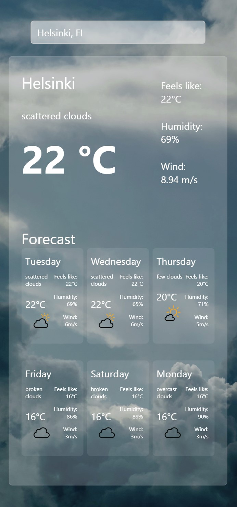

# Weather App

This is a simple weather application built using React, designed to display current weather and forecasts for different cities. The app utilizes the OpenWeatherMap API for weather data, GeoDB for city location data and provides a search feature to look up weather information for specific cities.

## Features

- **Current Weather**: Display current weather information including temperature, humidity, wind speed, and more.

- **6-Day Forecast**: View a 6-day weather forecast for the selected location.

- **Automatic Location Detection**: The app automatically detects the user's current location for quick weather updates.

- **Location Search**: Users can search for weather information in different locations.

- **Responsive Design**: Enjoy a seamless experience on various devices, ensuring accessibility on the go.

## Demo
[View the live demo](https://weatherapp-coral-iota.vercel.app/)



## Table of Contents

- [Prerequisites](#prerequisites)
- [Installation](#installation)
- [Usage](#usage)
- [Acknowledgments](#acknowledgments)
- [License](#license)

## Prerequisites

- Node.js and npm (Node Package Manager) installed on your system.

## API Keys

This WeatherApp uses the OpenWeatherMap API to fetch weather data and GeoDB API to fetch global city data. To make it work, you'll need to provide your own API key. Here's how:

1. Sign up for a free account on [OpenWeatherMap](https://openweathermap.org/api) and [GeoDB](https://rapidapi.com/wirefreethought/api/geodb-cities/).

2. Create a file named `.env` in the root directory and add your API keys:

```plaintext
REACT_APP_WEATHER_API_KEY=your_api_key_here
REACT_APP_GEODB_API_KEY=your_api_key_here
```

### Installation

1. Clone the repository:

```bash
git clone https://github.com/your-username/your-weather-app.git
cd your-weather-app
```

2. Install the required dependencies:
   
```bash
npm install
```
3. Start the development server:

```bash
npm start
```

Open a web browser and navigate to http://localhost:3000 to view the app.

## Usage

1. The app will attempt to fetch weather data based on your current location upon opening.
2. You can search for weather information in other cities by typing the city name in the search bar.
3. The app will display the current weather information as well as a 5-day forecast for the selected city.

## Acknowledgments
This project was built using React and relies on the following external libraries:
<ul>
  <li> react-select-async-paginate: For the asynchronous city search feature.</li>
  <li>OpenWeatherMap API: Provides weather data for the app.</li>
  <li>GeoDP API: Provides city location data for the weather search</li>
</ul>

## License
This project is licensed under the MIT License. <br /> Feel free to use and modify the code as needed.
